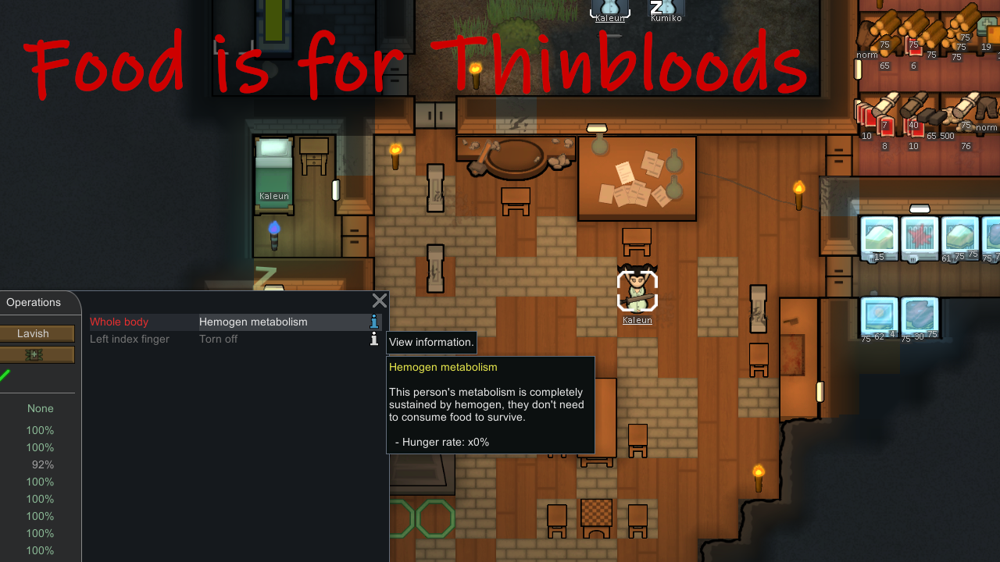

# Food is for Thinbloods (WIP)
A mod for the RimWorld game

The Hemogen Drain gene now still increases hemogen drain by -8 per day (like vanilla) but also completely disables hunger drain.\
That means pawns with this gene (such as vanilla Sanguophages) no longer need to eat any food to survive.\
You can still make custom xenotypes that need/use hemogen but also need regular food by using other Hemogen genes.

This is just a quick, simple mod I made for my own game and a custom xenotype I'm working on. I decided to publish it because there doesn't seem to be another mod that does the same thing for 1.5 (yet).\
I have chosen to modify the Hemogen Drain gene instead of adding a custom one because it was the simplest way to disable hunger in vanilla Sanguophages (which I think is what most folks will use this mod for), even if adding the mod midgame.\
Removing the mod shouldn't break anything but I wouldn't try it without a backup save.

At some point I will probably re-do a better version of this mod (or a new mod entirely) that, instead of completely disabling hunger, ties it to Hemogen level (or scales Hemogen level drain with metabolic efficiency).\
As it is hemogen drain is always the same, no matter what the pawn's hunger rate was, which feels a bit cheap.
